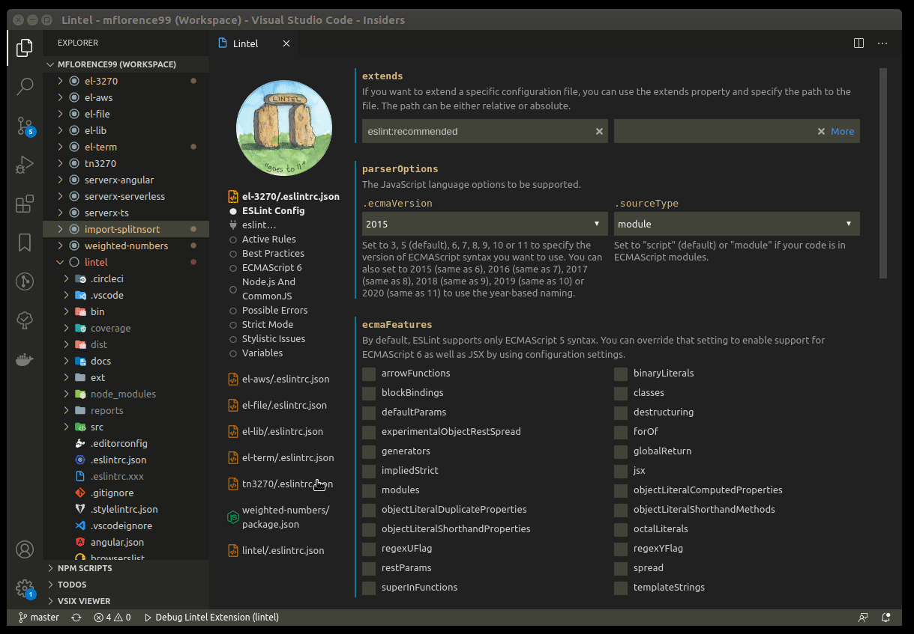
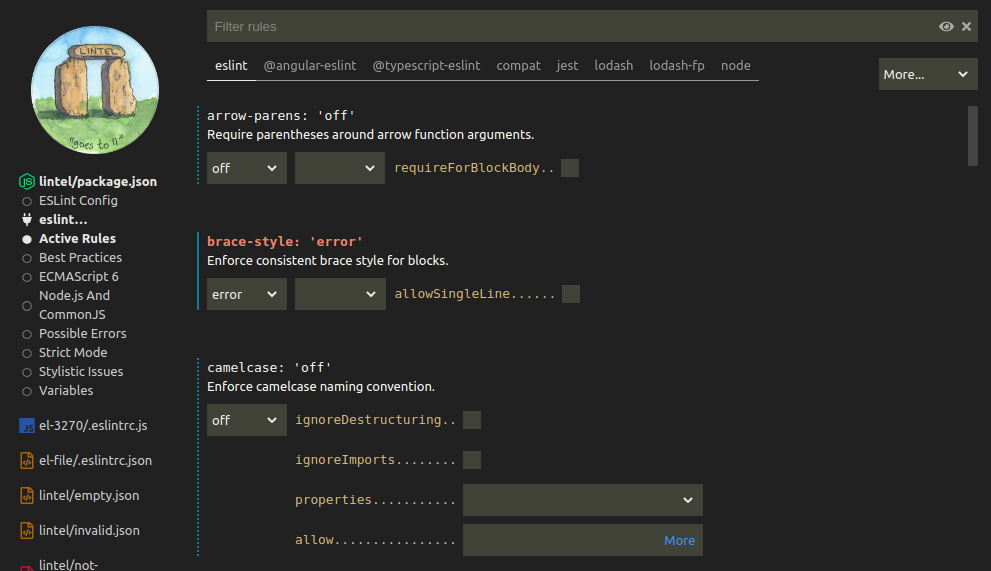
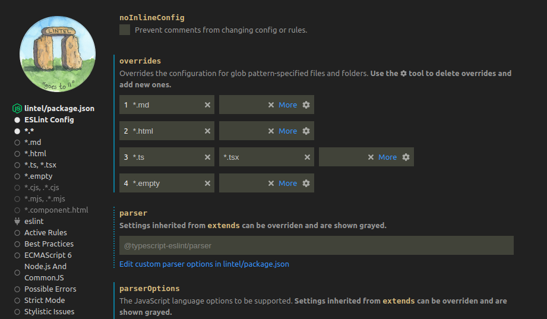
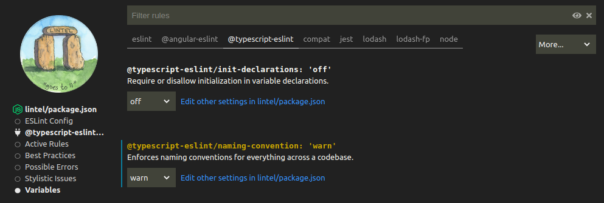

# Lintel: ESLint Configuration File Visualizer

  

The Lintel VSCode extension provides a rich UI to visualize, edit and mange your ESLint configuration files. It finds and analyzes all the configurations in your workspace and loads that analysis into its sidebar, from which you can drill into individual rules and their settings.

## Getting Started

1. Download Lintel from the marketplace and install it following the instructions above.
2. Run the command `Lintel: ESLint Configuration File Visualizer`.

## Features

- All configurations in `.eslintrc.*` files, together with those stored in an `eslintConfig` key of a project's `package.json` are loaded.
- As changes are made, Lintel will keep in sync with any configurations you edit manually (eg: in a VSCode text editor) and vice versa.
- Lintel will preserve any comments you have placed in JSON, YAML or JavaScript configuration files.
  > Comments aren't allowed in `package.json` files and are not currently supported in YAML files.
- Configurations are broken down by rule category (eg: Best Practices) and plugin (eg: `@typescript/eslint`).
- "Active Rules" shows just the rules that you've actually set, plus (optionally) those inherited via plugin `extends`.
- The rule you're looking for can be quickly found by a partial match to a name you type in the filter bar.
- A 'cog' tool (like the settings editor in VSCode) supports additional operations, like removing a rule from your configuration.
- The documentation for any rule is immediately accessible by clicking on the rule name.
- Lintel is backed by over 500 Jest unit tests.

## Settings Options

Lintel contributes the following variables to the [settings](https://code.visualstudio.com/docs/getstarted/settings):

- `lintel.ignoredDirectories` - A list of directories _not_ searched for `.eslintrc.*` and `package.json` files. Defaults to `node_modules`, `build`, `dist` and `out`.
- `lintel.updateDebounceTime` - The lag time in ms between changes you make through Lintel's UI and when your configuration is saved. Defaults to 2500ms.

## How it Works

Lintel is driven purely by the JSON schemas of ESLint configuration files and of the rules that individual plugins publish. The `.eslintrc` schema is published by [SchemaStore](https://github.com/SchemaStore/schemastore/blob/master/src/schemas/json/eslintrc.json).

Lintel runs ESLint but using your project's `node_modules` to load plugins and extract their rules schema. At the same time, it grabs the settings of rules that your configuration extends, for example via `plugin:@typescript-eslint/recommended`.

So that startup is as fast as possible, Lintel comes prepackaged with the rules schema and settings for many popular plugins, including React, Vue, Jest and Node. These are updated asynchronously with the plugins actually installed in your project.

Lintel is not a "wizard." It can't setup an ESLint installation from scratch nor install plugins itself - although all this is on the roadmap. At least a minimal `.eslintrc` configuration is required and all needed plugins must be pre-installed.

## Active Rules

Active Rules shows all the rules that are currently defined in your configuration, plus those inherited from plugin `extends`.

- The analysis of inherited rules can be toggled via the 'eye' button in the filter bar.
- Rules actually present in your configuration are highlighted by a solid bar and those inherited via a dotted bar.

> Hover over a rule and a `cog' tool (like the settings editor in VSCode itself) appears. One operation allows a rule to be removed from your configuration. If that rule is also exposed by a plugin, then the UI reverts to the plugin's settings.

## Overrides

Overrides are shown in the sidebar by their file filters, from which they can be selected to pivot the UI. Overrides are defined on the config page.

- `*.*` is a way to pivot back to the base configuration.
- Grayed overrides (like `*.components.html` in the screenshot) are inherited from plugins. They can't be changed but they can be selected for analysis.

## Rules Lintel Can't Handle

Some rules would require a UI that would be significantly harder to understand than the underlying JSON itself.

Lintel still allows you to set the rule level to `off`, `warn` or `error` and any other settings are undisturbed. The "edit" link opens up the configuration (if possible, in a VSCode column beside Lintel's) so that the remaining settings can be edited manually. Lintel stays synchronized with manual changes, as does your open configuration with Lintel's.

## Roadmap

Lintel should support plugin installation and creation of an ESLint configuration from scratch.

Comments in YAML files need to be supported.

## Credits

A very big thank you to ...

The Lintel UI is built with [Angular](https://angular.io/), IMHO still the best. Also still the best state management store is [ngxs](https://www.ngxs.io/) and its very clever simplification [ngxs-labs/data](https://github.com/ngxs-labs/data/blob/HEAD/docs/README.md).

Dustin Specker has published [awesome-eslint](https://github.com/dustinspecker/awesome-eslint), a fabulous curated list of ESLint plugins.

Kael Zhang's [comment-json](https://github.com/kaelzhang/node-comment-json) does a great job of preserving comments in JSON files.

"Lintel" is a portmanteau of "lint" and "intel(ligence)" but it also has a meaning of its own, which inspired [Lynn Hendrickson](https://lynnzware.biz/) to create its whimsical icon.
